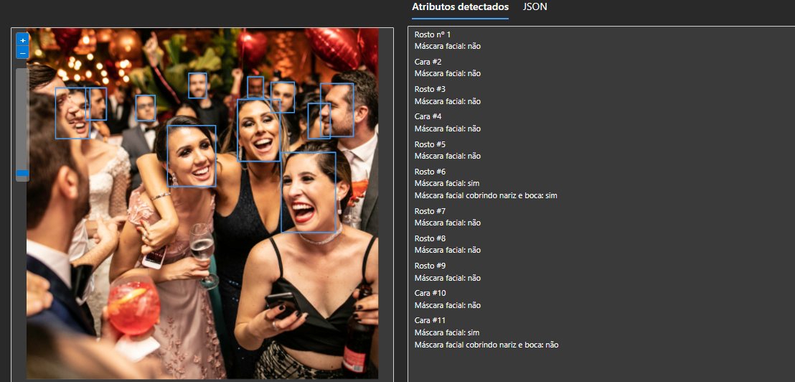
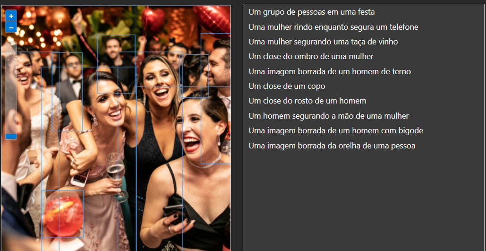

# Azure AI Vision Studio

O Azure AI Vision Studio é uma ferramenta poderosa oferecida pela Microsoft Azure que permite aos usuários construir, treinar e implantar modelos de visão computacional de forma simplificada e eficiente. Esta plataforma integrada oferece uma variedade de recursos e funcionalidades para facilitar o desenvolvimento de soluções de inteligência artificial (IA) baseadas em visão.

## Processo

### 1. Acesso ao Azure AI Vision Studio

Para acessar o Azure AI Vision Studio, siga os seguintes passos:

1. Acesse o [Portal Azure](https://portal.azure.com/).
2. Faça login na sua conta Azure.
3. No painel esquerdo, selecione "IA + Machine Learning".
4. Selecione "Estúdio de Visão".

### 2. Desenvolvimento do Modelo

Com o Azure AI Vision Studio, você pode criar modelos de visão computacional de forma intuitiva, usando uma variedade de técnicas e algoritmos disponíveis. Algumas etapas do processo de desenvolvimento incluem:

- **Coleta e Preparação de Dados**: Importe conjuntos de dados e prepare-os para treinamento.
- **Seleção de Algoritmos**: Escolha os algoritmos de visão computacional mais adequados para o seu cenário.
- **Treinamento do Modelo**: Treine o modelo com os dados disponíveis e ajuste os parâmetros conforme necessário.
- **Avaliação do Modelo**: Avalie o desempenho do modelo usando métricas relevantes.
- **Implantação do Modelo**: Implante o modelo treinado em produção para realizar inferências em tempo real.

## Possibilidades

As capacidades de visão computacional oferecidas pelo Azure AI Vision Studio podem ser aplicadas em uma variedade de cenários, incluindo reconhecimento de objetos, detecção de rostos, análise de imagem médica, entre outros.

**- Extraia texto de imagens:** a API Read permite extrair texto de imagens, PDFs e arquivos TIFF, incluindo texto impresso e manuscrito em vários idiomas suportados. O recurso de reconhecimento óptico de caracteres (OCR) é capaz de lidar com documentos que contenham uma mistura de idiomas, sem a necessidade de especificar o idioma. 

  Detecção de texto com letra cursiva.   Detecção de texto em imagem. 

O Vision Studio faz a detecção automática do idioma e a sua tradução. Apresenta os dados em forma descritiva e em opção de código, basta selecionar a aba para visualizar os dados.
 <br> 
```json
{
  "linhas": [
    {
      "texto": "Amor",
      "boundingPolígono": [
        {
          "x": 87,
          "s": 245
        },
        {
          "x": 502,
          "você": 233
        },
        {
          "x": 503,
          "s": 328
        },
        {
          "x": 91,
          "s": 346
        }
      ],
      "palavras": [
        {
          "texto": "Amor",
          "boundingPolígono": [
            {
              "x": 91,
              "s": 264
            },
            {
              "x": 450,
              "s": 235
            },
            {
              "x": 448,
              "você": 329
            },
            {
              "x": 107,
              "s": 346
            }
          ],
          "confiança": 0,323
        }
      ]
    }
  ]
}
```


Identificação da escrita por reconhecimento e tradução automática para o idioma escolhido na configiração da aplicação.  

**- Análise espacial:** permite compreender a distribuição e relação entre objetos em imagens e vídeos. Oferece recursos como detecção de objetos, segmentação semântica e reconhecimento de formas para identificar padrões geoespaciais e facilitar análises mais detalhadas. Essa funcionalidade é fundamental para aplicações de vigilância, mapeamento urbano e análise de dados geográficos.As opções deste recurso:
-Recuperação e resumo de um vídeo.
-Contagem de pessoas em uma área.
-Detectar quando uma ou mais pessoas ultrapassam um limite.
-Detectar quando uma ou mais pessoas entram ou saem de uma zona delimitada.
-Monitorar o distanciamento social.

**- Face:** a funcionalidade Face do Azure AI Vision Studio oferece recursos avançados de reconhecimento facial, permitindo a detecção e análise de rostos em imagens e vídeos. Com capacidades de identificação, verificação, análise de emoções e atributos faciais, essa funcionalidade permite criar aplicações de reconhecimento facial altamente precisas e escaláveis. Ideal para aplicações de segurança, personalização de experiência do usuário e análise de emoções em tempo real.



**- Análise de imagem:** a funcionalidade de Análise de Imagem do Azure AI Vision Studio oferece uma variedade de recursos poderosos para entender e extrair informações de imagens. Algumas das possibilidades apresentadas no site desta função incluem:
1- Reconhecer produtos em uma prateleira
2- Personalize modelos com imagem 
3- Pesquise fotos com recuperação de imagem
4- Adicone legendas densas às imagens 
5- Remover fundo de imagens
6- Adicionar legendas às imagens
7- Detecta objetos comuns em imagens
8- Extraia tags comuns das imagens 
9- Detecta conteúdo confidencial em imagens
10- Cria imagens cortadas de forma inteligente

Utilizando a mesma imagem já utilizada neste documento para contagem de pessoas, utilizando a funcionalidade **Adicione legendas densas às imagens**.




## Conclusão

O Azure AI Vision Studio é uma ferramenta poderosa para o desenvolvimento de modelos de visão computacional na nuvem. Com sua interface intuitiva, integração com outros serviços Azure e capacidades avançadas de desenvolvimento e implantação de modelos, o Azure AI Vision Studio capacita desenvolvedores e empresas a construir soluções de IA inovadoras e escaláveis, com infinitas atribuições para os resultados das funcionalidades.

Para saber mais sobre o Azure AI Vision Studio, visite o [site oficial](https://azure.microsoft.com/en-us/services/cognitive-services/computer-vision/).


Imagens utilizadas foram captadas na biblioteca gratuita do Canva (www.canva.com).


